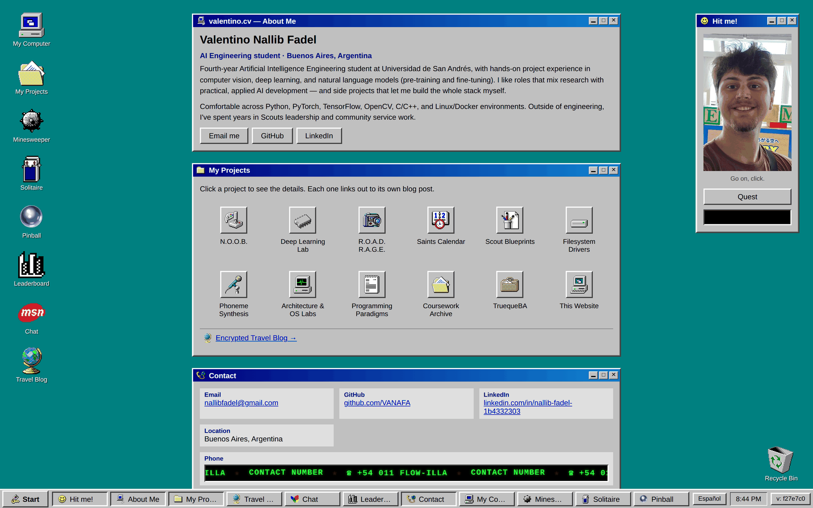

<div align="center">

# [nallib.ar](https://nallib.ar)

**A Windows 98 desktop, as a portfolio site.**

[](https://nallib.ar)

### 🖥️ Live at **[nallib.ar](https://nallib.ar)**

</div>

A tiny, dependency-free static site (no build step, no framework) styled like
Windows 98, deployed at **[nallib.ar](https://nallib.ar)**. Open `index.html`
directly in a browser, or host the folder as-is on any static host (GitHub
Pages, Netlify, etc.).

## Previewing before you deploy

`./serve.sh` starts a local server (`http://localhost:8000`) so you can click
around and test changes before they go live — this is the same "dev build"
you'll see once deployed, except any feature listed in
`js/features.js` is visible here even though it's hidden on the live site
(see below). Run `./deploy.sh` only once you're happy with what you see
locally.

## Hiding a work-in-progress feature

Some features aren't ready to be publicly discoverable yet but are still
worth testing locally (the Travel Blog used to be the example here - it's
shipped now, so `HIDDEN_IN_PROD` is currently empty). `js/features.js`
hides a feature's nav entry points — desktop icon, "Encrypted Travel Blog"
link, etc. — whenever the page isn't running on `localhost`/`file://`, i.e.
only on the deployed site. The exact same files are served in both places;
nothing is stripped out at deploy time.

This is a soft hide, not a security boundary: `travel.html` still works over
a direct link even on the live site — that's the point, since it's meant to
be shared with friends directly (see "Travel blog (encrypted)" below).

To hide a new feature: add its name to `HIDDEN_IN_PROD` in `js/features.js`,
then either tag its static nav entry with `data-feature="that-name"` (auto-
hidden), or check `window.isFeatureHidden("that-name")` if the entry is
built from JS (like the desktop icons in `js/desktopicons.js`).

## Adding a new project / blog post

Everything lives in one place: **`js/data.js`**.

1. Open `js/data.js`.
2. Copy one of the existing objects in the `PROJECTS` array and paste it as a
   new entry.
3. Fill in the shared fields:
   - `id` — a unique slug (letters/numbers/dashes only), used in the URL as
     `blog.html?id=your-id`.
   - `glyph` — path to an icon in `images/icons/`.
   - `images` — paths to screenshots/photos (drop files into `images/`).
   - `tech` — tag list.
   - `repo` — optional GitHub URL, shown as a button on the blog page.
4. Fill in the text once per language, inside `en` and `es`:
   - `title`, `tagline`, `summary`, and `blog` (an array of strings, one per
     paragraph). `es` is Argentinian Spanish; if you omit it, English is used.
5. Save the file.

That's it — no other file needs to change:

- The new project's icon appears automatically in the "My Projects" list on
  `index.html`.
- Clicking it opens the pop-up with your summary/photos and a
  "To know more →" link.
- That link opens the post as a window on the same page — no navigation,
  same as Minesweeper or Solitaire — rendered by the shared `js/blog.js`
  template from the same `data.js` entry, so every project gets a working
  post for free. It's also directly linkable/shareable at
  `blog.html?id=your-id` if you ever need a bare URL to one post.

## Structure

```
index.html        Home page: about me + auto-generated project list + contact
blog.html          blog.html?id=... is a direct/shareable link to one post
travel.html        The encrypted travel blog
serve.sh           Local preview server - run before deploy.sh
deploy.sh          Stamps assets, commits, and pushes to the live site
css/win98.css      All the Windows 98 styling
js/data.js         <-- the file you edit to add/change projects
js/main.js         Renders the project grid + pop-up on index.html
js/blog.js         Renders a project's post into the shared "blog" window -
                   opened in place from the pop-up, on whichever page you're on
js/features.js     Hides work-in-progress features on the live site only
js/windows.js      Minimize/maximize/close + taskbar buttons for each window
js/i18n.js         English / Argentinian Spanish strings + language toggle
js/taskbar.js      Decorative taskbar clock
js/version.js      Version badge showing the deployed commit
images/icons/      Real Windows 98 .ico icons used across the site
images/            Photos/screenshots referenced from data.js
images/screenshot.png  The shot of the live site at the top of this README
```

## Windows behave like real windows

Every top-level window (About Me, My Projects, Contact, Project Blog) has
working minimize/maximize/close buttons and a matching button in the taskbar
at the bottom of the screen:

- **Minimize (_)** or **Close (✕)** hides the window; its taskbar button stays
  so you can click it again to bring the window back.
- **Maximize (□)** expands the window to fill the screen; click it again to
  restore.
- **Start** always goes back to `index.html`.

This is handled generically by `js/windows.js` for any `.window` element that
has a `data-window="some-id"` attribute — add that attribute to a new window
section and it gets minimize/maximize/close + a taskbar button for free.

## Replacing the placeholder images

`images/placeholder-*.png` are stand-ins for project screenshots. Drop real
screenshots/photos into `images/` and point each project's `images` array at
them in `js/data.js`.

## Editing your name/bio/contact info

Those are plain HTML in `index.html` (the "About Me" and "Contact" windows)
and duplicated in the "Contact" window of `blog.html`. Edit the text directly.

## Languages

The site is bilingual (English / Argentinian Spanish). Static interface text
lives in `js/i18n.js` — add a key there and reference it from HTML with
`data-i18n="your.key"`. Project text lives per-language inside each project's
`en` / `es` block in `js/data.js`.

The button in the taskbar toggles between them and remembers the choice in
`localStorage`, so it carries across pages.

## Desktop backgrounds

Click the "My Computer" icon on the left of the desktop to pick a wallpaper.
The choice is saved in the browser and carries over to every page, the same
way the language toggle does.

To add a new one:

1. Drop the original photo into `images/bgs/`.
2. Run `python3 tools/make_bg_variants.py` - it generates a resized copy used
   as the actual wallpaper plus a small thumbnail for the picker, so a
   multi-megabyte photo is never downloaded just to preview it.
3. Add one entry to `js/backgrounds.js` (id, English/Spanish label, and the
   two paths the script just created).

## Custom sounds

Every sound effect (`sounds/*.mp3`) starts as a tiny silent placeholder.
Replace any of them with a real recording under the same filename and the
site picks it up automatically - no code change needed:

```
sounds/pick.mp3       picking up the chipa
sounds/drop.mp3       dropping it without feeding it to him
sounds/chew.mp3       one chomp (plays several times per chipa)
sounds/swallow.mp3    finishing the mouthful
sounds/hit.mp3        getting hit
sounds/speak.mp3      one syllable while the quest line types out
sounds/burp.mp3       the burp, every 3rd chipa
```

`js/sfx.js` checks each file's size at load: anything at or below the
placeholder size falls back to a synthesised sound, so the site always has
something even before you've recorded your own. To reset one back to the
placeholder: `python3 tools/make_sound_placeholders.py`.

## Games

Minesweeper and Solitaire live behind their own desktop icons, next to My
Computer. Both are plain JS, no libraries:

- **Minesweeper** (`js/minesweeper.js`) - Beginner/Intermediate/Expert, safe
  first click, flood-fill reveal, right-click to flag (or press-and-hold,
  which works the same on touch).
- **Solitaire** (`js/solitaire.js`) - Klondike, draw-one. Click a card (or the
  exposed run below it) to select, then click a pile to move it there -
  no drag-and-drop, so it works the same on touch. Double-click sends a card
  to a foundation if that's legal. Card faces are the CC0 pixel-art deck from
  Kenney (`images/cards/CREDIT.txt`), not the real Microsoft Solitaire
  graphics - those are proprietary and can't legally be redistributed here.

## Travel blog (encrypted)

`travel.html` is a separate page (linked from "My Projects" and from a
desktop icon) gated behind a question only friends should be able to answer.
This is **real encryption**, not a cosmetic effect: everything - every
title, paragraph, and photo - is AES-256-GCM ciphertext sitting in
`js/traveldata.js`, keyed by PBKDF2 over the answer. Nobody, including this
repo's own source code, has the plaintext until a visitor's browser derives
the right key and WebCrypto decrypts it locally. What you see before
unlocking really is the raw ciphertext (shown as the "encrypted" preview);
after unlocking, text does a short decode-scramble animation and photos
reveal via a tile-shuffle animation on canvas - both purely cosmetic, since
the real security already happened by that point.

The one thing this can't protect against: the ciphertext and salt are public
(they're sitting right there in the page source), so someone could try an
offline dictionary attack against a short list of likely answers. Pick an
answer a stranger couldn't easily guess or brute-force from a small set of
options, even if it's obvious to friends who know you.

Trips render newest-first (sorted by `date` after decrypting), and each
trip's content is an ordered list of `blocks` - `{ type: "text", body }` or
`{ type: "image", src/date }` - so text and photos can be interleaved
however the author wants, with an optional date on each individual photo
(separate from the trip's own overall date).

**Adding a real entry - two ways:**

- **Visual editor:** open `travel-admin.html` locally (not linked from the
  site - see its own on-page warning for what that URL-obscurity does and
  doesn't protect) - it can load and decrypt what's currently live, let you
  add/reorder trips and text/image blocks in a form, then either download
  the resulting `traveldata.js` or push it straight to GitHub with a
  personal access token (entered there, kept only in that browser's
  localStorage if you opt in, never committed anywhere).
- **CLI, for scripting:** copy `tools/travel-demo-assets/demo-content.json`
  somewhere outside the repo (or to a gitignored path like
  `tools/travel-content.json`) and fill in real trips: `title`, `location`,
  `date`, and a `blocks` array (see the comment atop
  `tools/encrypt_travel.js` for the exact shape). Then run:

  ```sh
  node tools/encrypt_travel.js tools/travel-content.json
  ```

  and type the real answer when prompted - the prompt is hidden (nothing
  echoed, nothing in shell history). This overwrites `js/traveldata.js`
  with fresh ciphertext. Both paths write the exact same file shape and are
  interchangeable.

Either way, commit and deploy as usual afterwards (or let `travel-admin.html`
push the commit for you). The plaintext JSON and source photos should
**not** be committed - `.gitignore` already excludes the conventional
`tools/travel-content.json` / `tools/travel-photos/` paths.

The bundled `demo-trip` entry exists just so the mechanism has something
real to decrypt out of the box - its answer is `casio`. Replace it the same
way once there's real content.
